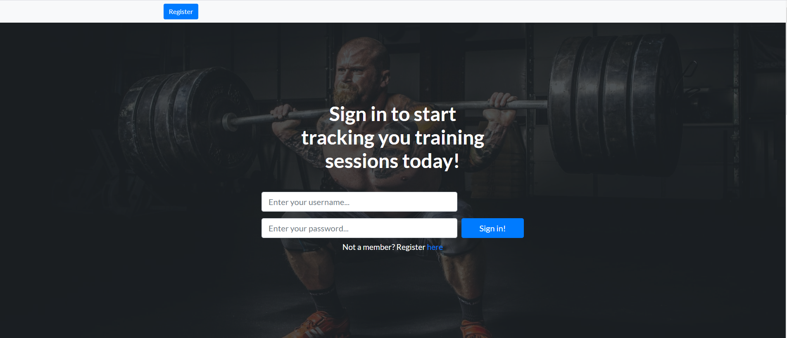
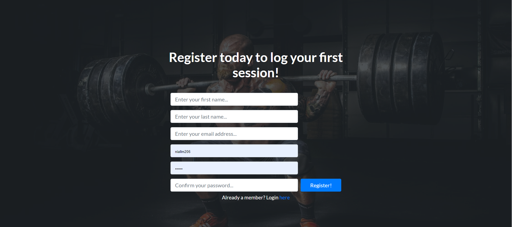
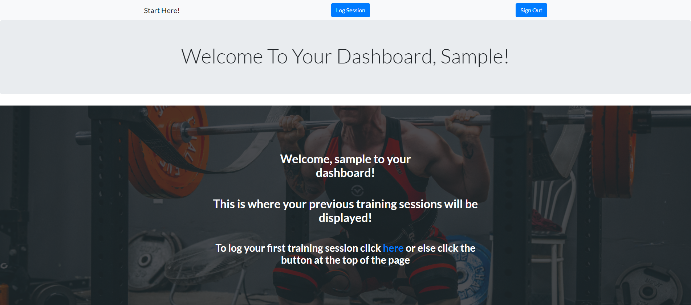
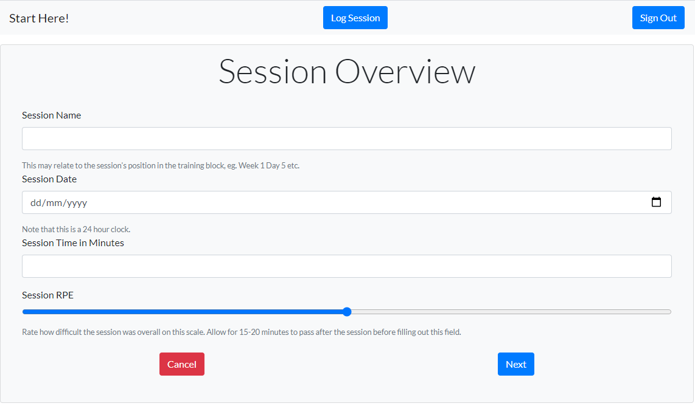
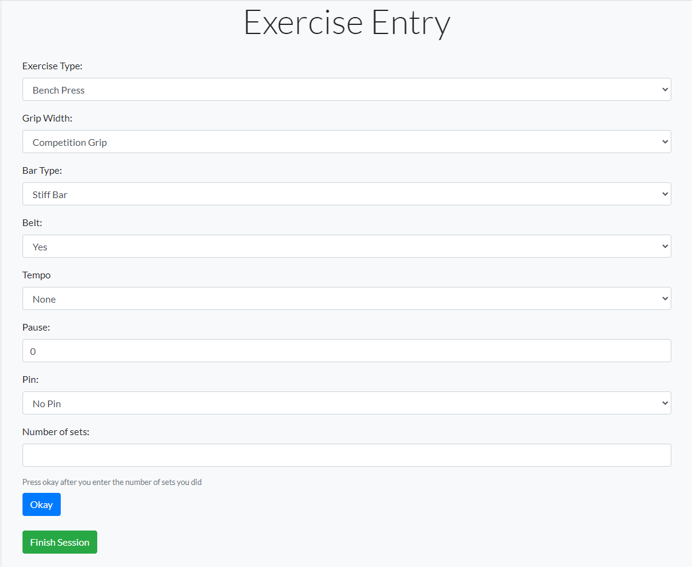
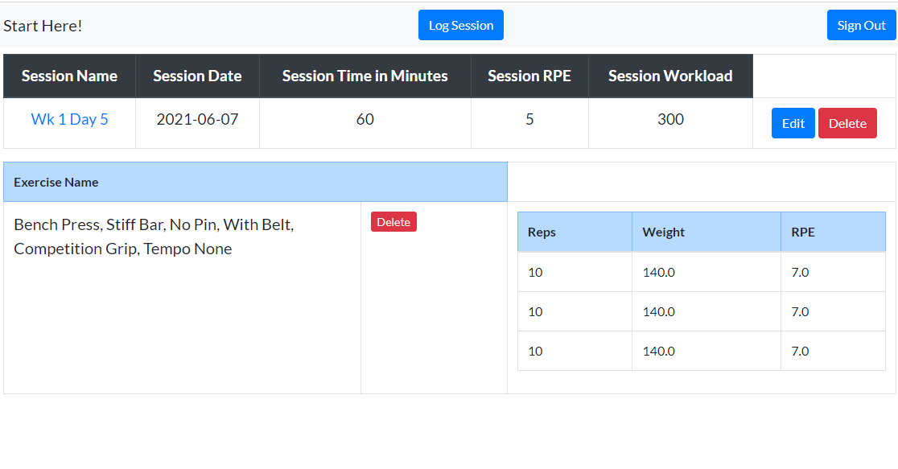
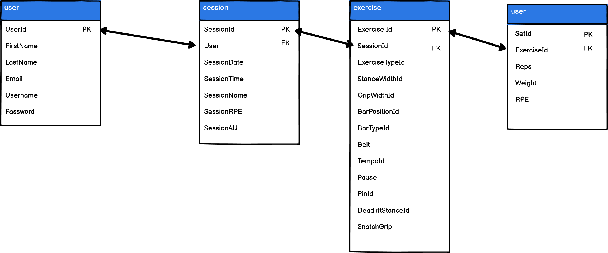
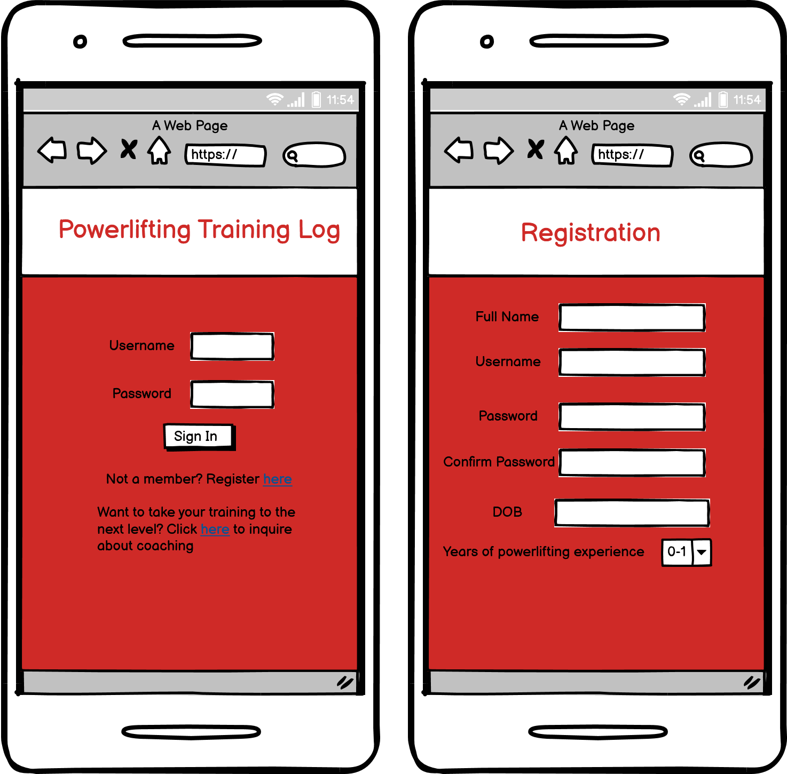
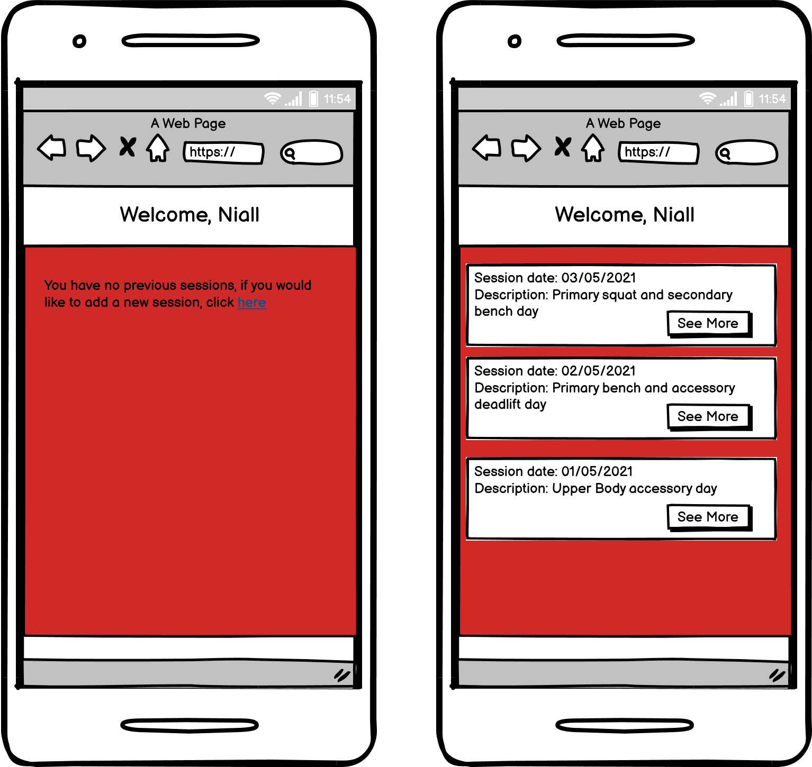
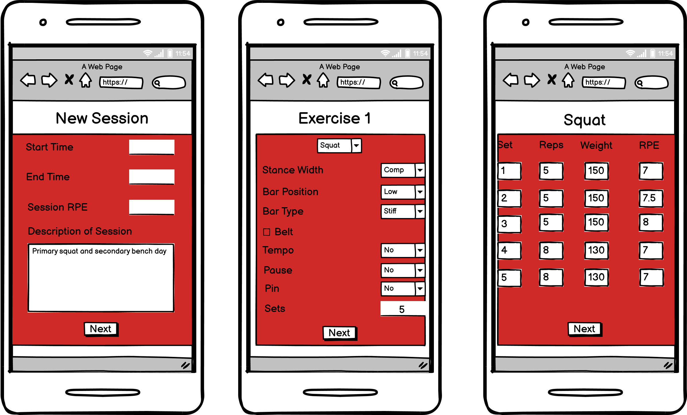

# Powerlifting Training Log

# Project Overview
This site is being created to meet the needs of powerlifters specifically. As a powerlifter myself and a sports science graduate, I understand the importance of data as it relates to sport performance and training. Being precise with the stimulus that is applied during each training session will allow for more predictable results and a lower likelihood of injury. Also a grearter history of data will allow for more accurate predictions of future responses to training. Furthermore, powerlifters compete in the three main lifts which are the squat, the bench press, and the deadlift. While these are only three exercises, there are actually so many modifications of these exercises which most powerlifters regularly train. Keeping track of your performance in a distant variation of the main lift is a very important thing which is quite hard to do. Therefore, this app will be an easy way to look back over your performance in these more obscure lifts such as the 3 1 0 tempo, beltless, high bar squat. It will also allow the user to easily see their performance in the main lift which in this case is the low bar squat with a belt.

## Running the project
To run this project, firstly you need to run the sql file called gymdb3.sql. This will create the database and the tables within it. Next you need to run the sql file called makeDisplayExerciseView.sql. This will create a table which makes the displaying of the data on the front end much easier. On the python side, you need to install flask, pymysql, and dotenv. You will also have to create your own env.py file in which you declare your flask secret key and the database details.  

# General Features

## This is the main home page the user will be greeted with when they first land on the site. The option to login will be the first option they are given.
- The hero image on this page was taken from pexels by photographer [Binyamin Mellish](https://www.pexels.com/@binyaminmellish)
- This image gives a great legitimacy to the site in my opinion and sets the tone for a professional looking site

## A similar theme was kept for the registration page, to allow for consistency and intuitive, first-time learning.
- The same image was used for this page to keep consistency for the user. This improves user experience.
- I kept the registration form as simple as possible to prevent 

## This is the sample dashboard for a user with no sessions.
- This image is only displayed if the user has no sessions.
- This image was taken from Unsplash by photographer [Alora Griffiths](https://unsplash.com/@aloragriffiths)

## This is the session entry form where the user inputs the general information regarding time of session and overall session difficulty.
- This form is meant to be as user friendly as possible to save the user as much time as possible

## This is the exercise entry form. This form is dependant on the exercise the user inputs.
- Depending on the exercise the user inputs they will be shown different options
- If the user inputs squat, the form displays stance width and bar position
- If the user bench press, the form displays grip width as a parameter instead of the squat only options
- If the user inputs deadlift, the form displays the deadlift specific parameters, which are deadlift stance and snatch grip
- For all other exercises the user is only given the option to input their sets as these exercise modifiers generally do not apply to other, more basic exercises

## This is a sample dashboard containing a previous session. In this session the user has only inputted one exercise with 3 sets logged for that exercise.
- This is a preview of the user dashboard. In this example we can see that the user named this session Week 1 Day 5 and completed it on the 7th of June
- The session took 60 minutes and was rated a 5/10 in terms of difficulty which computes to a session workload of 300 Units
- The user completed one exercise in the session with three sets for that exercise. 
- The user has the ability to edit and delete the session information
- The user also has the ability to delete exercises from the session.

# UX
## 5 Planes of UX
### Strategy
- The strategy of this app is to create a user friendly site for powerlifters to store their training data. As this is a time consuming process even with user friendly design, the user will inevitably spend lots of time on the site if they consistently log their sessions on the site. Therefore, if this site became popular enough it could have very high levels of engagement and interaction with the powerlifting community. In the initial stages of the app, the most important thing is the data intake, and making it as easy as possible for users to store obscure variations of the main powerlifts. Over time, more effort could be directed towards the marketing of online coaching and merchandise sales.
### Scope 
#### Features
1) This project will require a registration, sign in, and sign out functionality. The ability to sign in is critical to allow the user to be able to look back at their old data which is the whole purpose of this app. 
2) This project will require the ability to run calculations on the data given to it and populate tables with this newly generated data. These data will be interpreted by the user 
3) The CRUD accronym will apply here, so the user will be able to create, read, update and delete their own data. 
4) There will be an admin user who can overlook all of the data stored in the database. 
5) The data entry form must be user friendly and be relatively intuitive
### Structure
The main landing page of the site will be the sign in page. Users will then be redirected to their personal dashboard, which will have some information on prior sessions if they have any. The only real place users will be able to go from here is either the sign out page or the log session page. The log session page will be intuitive and have several pages of forms which the user has to navigate through to log a session successfully. Following this they will be shown their session recap and be redirected to their dashboard. There may be another page which will offer them coaching advice/ general information on what to do with the metrics supplied by the app. 

 - In terms of the structure of the data being handled on the site owners side, here is a very basic schematic of the database
 - The user table was the first table genrated which stored data about the user. The UserId was the primary key of this table
 - Then the session table was generated. Each user would be able to create multiple sessions. The session Id was the primary key in this table and the UserId was stored in the session table as a foreign key. Nearly every input field in the exercise was a foreign key as they all were related to other tables in the database which are not included in the diagram. These tables provided names of exercises and bar positions and other information specific to powerlifting.
 - The exercise table is where the exercise data was stored. This data which was stored in this table was made up of data gathered from reference tables. Each exercise had an exercise Id which was the primary key but also had the forign key of the session Id. 
 - The sets table was used to store the data about the sets performed by the user. The primary key was the set Id and the exercise Id was used as a foriegn key to identify which exercise each set belonged to. 

### Skeleton
The interface design of this project was quite simple. I just wanted to offer the user a simple way of navigating throughout the site and entering their sessions in the most user friendly way possible considering the complexity of powerlifting exercises and their derivatives. Here are the early wireframes I created to allow me visualise this project before I began coding. 

### Surface
The surface of this project took shape after I had all the details of the other four planes of UX decided upon. To decide on how to make the site as visually appealing to the user as possible without causing distraction I went to the [start bootstrap](https://startbootstrap.com/) website to view attractive looking designs. When I found one I decided to try and extrapolate the design into a full site. The theme I used was called Landing Page and has nearly 500,000 downloads! It was a very easy to use template and allowed me to spend more time on the database while still having a very visually appealing design.

### User stories
#### Previous User
On opening the app the user will be immediately prompted to sign in or register. Then the user will be redirected to their personal dashboard which will have details on their prior sessions. There will be a large button asking them if they would like to log a new session. On the session logging screen they will be asked for the start and end times of the session and a few words of a description which will be optional. Next they are asked what their first exercise was, they will then select the modifiers that apply to that exercise. Finally they will be asked how many sets they completed and then they will click the next button. On the next page they will input the reps completed, the weight, and the RPE which stands for rating of perceived exertion which is a very well known metric in powerlifting circles. They will repeat these steps for the other exercises they completed during that session. Then they will just click the log session button to finish inputting the session. They will receive a flash message at this point thanking them for logging the session and they will be brought back to their dashboard where they will be able to view the already inputted sessions.

#### Admin
The admin of the app can login to the app to view all the sessions and exercises completed by all the users. If the admin wishes to have a more condensed view of this dashboard, the session name is a link which causes the exercise and set tables to be collapsed. This will allow the admin to see all the users who are uploading sessions to the database in a user friendly manner. 

## Bugs 

### Receiving error 405 when attempting to login
This error was occuring when trying to submit the login form. 
#### Fix 
- To fix this issue I added the action attribute of 'url_for('index')' to the form

### Selecting correct password to unhash
When I first began adding users to the database and hashing the password, I had an issue with unhashing it correctly. The password was being returned as incorrect whilst trying to login even if I was sure it was correct.
#### Fix
- I ensured that I indexed the result that was being returned from the database as I learned that the results were coming back as a tuple of tuples. So choosing position the first item of the first tuple allowed me to select the data I was looking for. 

### Using a checkbox on the exercise input page
The belt and snatch grip fields are both binary, meaning that the user either used a belt or didn't or deadlifted with a snatch grip or didn't. Given that, I decided to use a checkbox to allow the user to enter this in the most efficient and intuitive way possible. However, this caused the app to fail. 
#### Fix
- To fix this issue I simply switched the input type to a select box and this solved the issue. I also don't think I lost too much in terms of aesthetics.

### Dynamically showing forms depending on the answer given
For the exercise entry form I had a bug trying to display the correct form depending on the answer given. No matter what answer was given I wasn't able to display the correct forms. At first I thought the answer was to have three seperate forms.
#### Fix
The fix for this problem was to find what fields were common to all options. I then found what was the exercise showing by default and I hid the options that did not apply using javascript. Then when the user changed the exercise field, I had an event listener which checked the value of this field and then showed the correct fields depending on this user input.

### Retrieving the data from the dynamically generated set input fields
When I was retrieving the data from these fields, I had some unexpected behaviour as I had never retrieved multiple values from a form with the same name attribute. I used the request.form.getlist method to return all the values from input fields with the same name. However the issue with this was that I was getting all the reps values in one tuple, all the weight values in another tuple, and finally all the rpe values in another tuple. The issue with this was that the database needed the data to be given as with the exercise Id first and then the reps, weight and rpe in that order.
#### Fix
To fix this issue I used the zip method to zip all the tuples together. I then converted this to a list so that I could then append the exercise Id to the first position of the list. The data was then ready to be inserted into the database in that format.

### Passing through values to the database which didn't apply to a specific exercise
For example, if the user selected the exercise 'Incline Press' there were no modifiers for this exercise, and even when I hid them, the default value was still being passed through to the database.
#### Fix
The fix for this bug was simple, I just had to disable to input when I also hid the input. So using the same event listeners that I had created in javascript for hiding the elements, I just added script that would also disable them as well. This meant that they were being recorded in the database as Null which is what I wanted.

### Sessions with no exercises breaking the app
I found that if a session had no exercises in it, it would cause the app to crash. This behaviour was unexpected.
#### Fix 
To overcome this issue I simply had to remove the sessions with no exercises. I wrote a function called remove which I found the idea for on [Geeks for Geeks](https://www.geeksforgeeks.org/python-remove-empty-tuples-list/)

### Delete Session Bugs
When trying to implement the delete session functionality, I would receive an error
#### Fix
The fix for this bug was to add 'ON DELETE CASCADE' to the sql where the foreign keys were being declared in the gymdb3.sql file. This code means that when data in the main table is deleted, the associated rows in tables beneath that table also get deleted. This helps maintain the integrity of the data stored in the database.

## Attribution

### Images
- The main hero image on the home page and registration page were taken from [Binyamin Mellish](https://www.pexels.com/@binyaminmellish) on pexels
- The image used on the home image 3 and the dashboard if there are no sessions for the user was taken from [Alora Griffiths](https://unsplash.com/@aloragriffiths)
- The image used in home image two was taken by [Victor Freitas](https://www.pexels.com/@victorfreitas)
- The image used on home image one was taken by [Revolution Printers](https://pixabay.com/users/revolutionprinters-13267890/)

### Code
- The main aesthetic of the site was based around the template provided by [Start Bootstrap](https://startbootstrap.com/). The exact template I used can be found [here](https://startbootstrap.com/theme/landing-page). It includes lots of css and html to provide the core template with which to build a site around. 
- To generate the sql I used for creating the database I initially used [MySqlWorkBench](https://www.mysql.com/products/workbench/) and then made further changes with [PHPMyAdmin](https://www.phpmyadmin.net/). Then I exported this database as a sql file and ran it in the IDE.
- To remove the duplicates from a list that was returned by an sql query I used code found [here](https://www.geeksforgeeks.org/python-ways-to-remove-duplicates-from-list/)
- When learning to deal with multiple tuples which needed to be merged, I used the answers found [here](https://stackoverflow.com/questions/2407398/how-to-merge-lists-into-a-list-of-tuples)
- I used [this](https://blog.finxter.com/how-to-convert-list-of-tuples-to-list-of-lists-in-python/) resource to help with converting between lists and tuples which were nested inside each other
- I used [this](https://www.youtube.com/watch?v=BdsOxKCThhA&t=609s) video to help with the javascript code which I wrote to create the sets table on the exercise input form

## Testing

### Running the app from scratch
- The first thing I wanted to do while testing the app was run it from scratch in a new development environment. 
- So the first thing I did was install the required dependencies which are flask, pymysql and dotenv. I then checked if the app was running and it was. 
- Next, I ran the sql files to create the database. I installed the gymdb3.sql file first. This file created the database and the tables within it. 
- Then I ran the makeDisplayExerciseView.sql file to create the display_exercise view. At this point I received an error telling me that the secret key for the app wasn't set. 
- This shows that the dotenv variables need to be set for every gitpod environment you use if you use this method. 
- Following this, I revisited the code institute videos regarding the setting of environment variables and realised I did not understand the nature of the development environment. This lead to me creating another env file and declaring my environment variables inside it.
- I now understand that environment variables need to be set for each time you launch a new gitpod workspace from github. 

### App is now running - testing as brand new user
- As a new user landing on the home page I am greeted by a glossy image. I want to find out what the app is for so I can scroll down and read some brief information.
- There is plenty of direction to the registration page and the links are all working.
- The registration form is clear and easy to read. 
- At this point I tried to break the registration form in a few different ways such as entering only spaces for the names and things of this nature. 
- I had to fix my pattern attribute at this point to ensure that no spaces could be entered and only upper and lower case characters could be entered. 
- This will ensure that the data passed to the database is the best possible.
- I also tested the password matching code at this point to ensure that if the users passwords don't match that they won't be able to register. This was working correctly.

### Following initial registration
- Following the initial registration the user is redirected to their personal dashboard. At this point, since they have no previous training sessions to look at, their only option is to log a new session.
- I have aimed to make this clear by having text in the center of the screen which points them towards the session logging section. The users only other option at this point is to log out of the app and be returned to the landing page.
- I first tested the log out functionality by clicking on the button. This returns me to the home page where I no longer have access to the dashboard. I checked the browser cookies to ensure the session cookie has been removed. 

### Logging in
- At this point I aimed to log back into the app. I tested various log in details, using the correct username but incorrect password, the incorrect username with the correct password, these both returned the expected results.
- Finally, I entered the correct login details and was correctly logged into the user dashboard. 
- If the user closes the app without logging out, their session cookie may not be removed. Therefore, when the user opens the site they need to have an alternative index page. In this case, the user is shown the homepage and has a large button with which to access their dashboard.

### Session Entry
- When the user is on the first session entry page they are greeted with a form asking them for basic details regarding the session. 
- There were multiple parts of this form to test. 
1. I tested the cancel button. This button returns the user to their dashboard correctly.
2. I tried entering the form with all the fields blank. The required attribute prevents the user from doing this. 
3. I entered values in the fields and submitted the form and the form was submitted as expected.

### Exercise Entry 
- When the user enters a session they are redirected to the exercise entry page
- This is also quite a complex form with multiple moving parts
1. I started first by entering the various exercise types to make sure that they were changing the fields below them correctly. When I selected squat, I wanted the bench press specific modifiers to disappear and to only be shown the squat parameters. I wanted the same to occur for the deadlift. Finally, I selected all the other exercises and the form hid all the other options as expected.
2. I tried to submit the form without inputting the number of sets completed. This is not possible because this button creates the submit button.
3. I tried submitting the form without filling in values for the weight, reps, and rpe inputs. They are required so this was not possible
4. I clicked finish session without adding any exercise to the session. This returned me to the dashboard with a session with no exercises in it. This behaviour is expected, and the user is told by a text box that they have a session logged with no exercise in the session. 
5. I added values to the weight, reps, and rpe column and posted the form. As expected, I was redirected to the dashboard and I was able to see the exercises I submitted with the associated weight, reps, and rpe.

### Navigating throughout the dashboard with multiple sessions
- I wanted to test how navigation throughout the dashboard was when the user has multiple sessions logged each with multiple exercises per session.
- The dashboard can be quite cluttered. I added a collapsible link to make the exercise and sets sub-tables collapsible so the user can just see the sessions they have completed.

#### Editing session data
- I clicked on the edit button next to the session data. I was redirected to the edit session page. I was shown the data which had been entered for that session. 
1. Clicking cancel on this form brings the user back to the dashboard.
2. Clicking confirm on this page without changing anything brings the user back to the dashboard with the session data remaining the same. 
3. Changing the session data and clicking confirm causes the data to be altered on returning to the dashboard.

#### Deleting session data
- On clicking the delete session button the user is asked to confirm that they want to delete the session. 
1. If the user click cancel at this stage, the session is not deleted.
2. If the user clicks confirm, the session, the exercises, and the sets associated with that session are deleted. 
3. If the user deletes all their session data they are shown the dashboard with the background image which provides instructions to them to log a session. 

#### Deleting exercise data
- If the user clicks on the delete exercise button, they are asked to confirm that they want to delete the exercise.
1. the user can click cancel which will prevent the exercise from being deleted.
2. the user can click confirm which will delete the session and all associated sets.

### Admin Capabilities
- The only difference between the admin user and the other users is that the admin has their own dashboard
- With regard to the testing of this user I first set up an admin account. To do this I 
1. Navigated to the registration page and entered my details but entered 'admin' in the username section
2. I was redirected to the standard dashboard
3. Since I had no sessions logged as this user, I was greeted with the standard dashboard. 
4. However, since I was logged in as the user admin, in the navigation bar there was a link to the admin dashboard.
5. In the admin dashboard I was able to see the sessions of the users which I had logged in the previous portion of the testing section. 
6. When I logged an exercise as the admin user I was able to see this exercise in the personal dashboard and in the admin dashboard among the other users' sessions.
7. At this point I also found some dummy data that had been inputted into the database during the initial trials of the database and is actually found in the gymdb3.sql file!
8. The admin also has the ability to edit and delete sessions inputted by other users. 

### Mobile Users
- Another big consideration for me during this project was the usability for mobile users, especially regarding the inputting of data as users may wish to input their session while they are still in the gym. 
- Therefore, while displaying the data well on mobile was important, I placed more emphasis on the data-entry side of things. 
- To test the validity of the app on mobile I used the chrome developer tools functionality and selected various mobile and tablet devices and then completed the following testing protocol
1. Firstly, I loaded the landing page up. I inspected all the elements on this page carefully, ensuring that the nav bar, the login form, and all the subsequent elements on this page were visable and visually appealing.
2. Next, I navigated to the registration page and completed the registration process. 
3. I was automatically redirected to the dashboard following registration. I inspected this page carefully, as it was the main dashboard for the users. On smaller screens I noticed some wrapping between the elements in the nav bar. To fix this I removed the dashboard link as I figured it wasn't as neccessary as the nav bar looking good on smaller screens.
4. The next thing I tested was the session input form. Everything was visible and looked good on smaller device sizes for this page.
5. Following this was the exercise entry form. After checking this form on both mobile and tablet devices, I was happy to finish this portion of the testing section. 
6. At this point I decided to remove the footer element altogether, as there was no more information I needed or wanted to convey to the user. This actually helped with the layout issues on mobile and larger screens, especially the dashboard as it removed some of the clutter from an already crowded screen. 

## Deployment 

